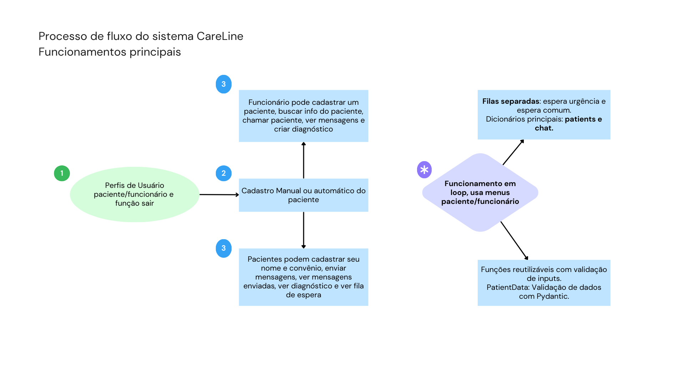

# 🏥 CareLine - Sistema de Atendimento Hospitalar

CareLine é um sistema desenvolvido para melhorar o **atendimento e a comunicação** entre pacientes e a equipe assistencial no Hospital Sabará. O sistema têm como pricipais funcionalidades: Ver a fila de espera, mandar mensagens em tempo real, também automatiza processos como cadastro, triagem por urgência, emissão de relatórios médicos e envio de mensagens.

## Objetivos do Projeto

- Automatizar a triagem e o atendimento hospitalar (Pronto-Socorro).
- Melhorar a experiência de pacientes e acompanhantes.
- Otimizar o fluxo de trabalho dos profissionais de saúde.
- Reduzir o tempo de espera e garantir organização na fila.

---

## Funcionalidades

### 👤 Paciente
- Cadastro com nome e convênio.
- Visualização da fila e sua posição.
- Acesso ao laudo médico e receita.
- Envio de mensagens à equipe (urgência, dúvidas, feedback).
- Sistema de alerta quando novos resultados estão disponíveis

### 👨‍⚕️ Funcionário
- Cadastro completo de pacientes com classificação de urgência.
- Chamada dos pacientes com prioridade.
- Emissão de laudos, receitas e mensagens.
- Leitura e filtragem de mensagens dos pacientes.

---

##  Estrutura do Código

- `PatientData`: Validação de dados com Pydantic.
- Filas separadas: `espera_urgencia` e `espera_comum`.
- Dicionários principais: `patients` e `chat`.
- Menus interativos para paciente e funcionário.
- Funções reutilizáveis com validação de inputs.

---

## Sistemas de Armazenamentos

- patients.json: Dados cadastrais + histórico
- fila_comum.json e fila_urgencia.json : Quantidade de pessoas em cada fila
- chat.json: Armazenamento de mensagens

---

## 🖼️ Fluxo de Funcionamento



---
## Tecnologias utilizadas

- Python 3.11+
- Pydantic
- Estruturas de dados básicas (`dict`, `list`, `queue`)
- Menu interativo com `loop`
- Estrutura modular e reutilizável
- JSON

## Requisitos Técnicos
- Biblioteca `pydantic`

Instale com:
```bash
pip install pydantic
```
## Video Apresentação e Demonstração
https://www.youtube.com/watch?v=PMhH0-Y2P0o

## Integrantes

| Nome                            | RM       |
|---------------------------------|----------|
| Pietro Brandalide De Andrade    | RM560142 |
| Ícaro Henrique de Souza Calixto | RM560278 |
| Caio Costa Beraldo              | RM560775 |
| Victor Kenzo Mikado             | RM560057 |

